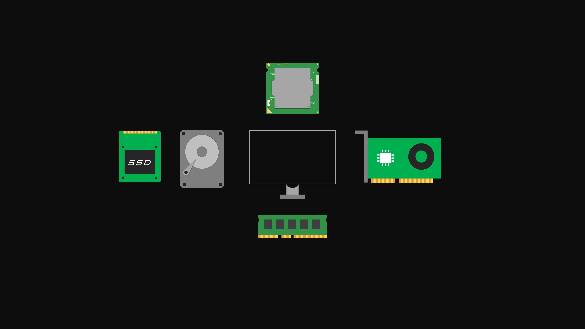

# Core-CS

A collection dedicated to promoting the study and appreciation of **core computer science concepts**. The focus is on building strong foundations that enable deeper understanding, problem-solving ability, and long-term growth in computing.  

Core computer science is more than just a prerequisite for advanced topics—it is the **language of logic, efficiency, and design** that underpins every modern technology. By engaging with fundamental ideas, learners not only sharpen their analytical thinking but also gain the tools to **adapt to new paradigms, innovate responsibly, and tackle complex challenges** in the evolving world of computing.  

This collection encourages curiosity, persistence, and a mindset that values **principles over shortcuts**, ensuring that knowledge remains relevant across domains, trends, and generations. 

  

## Why Core CS Matters?
- Provides the **fundamentals** that power all areas of technology  
- Sharpens **analytical and problem-solving skills**  
- Bridges the gap between **theory and real-world applications**  
- Forms the basis for **advanced fields** like AI, systems, and security  
- Encourages **lifelong learning and adaptability** in a rapidly changing field  

## What You’ll Find Here
- Educational **slides** and **reference resources**  
- Material to reinforce **conceptual clarity**  
- Structured resources for **self-study and revision**  
- A hub for learners passionate about strengthening their **core CS knowledge**  

## How to Engage?
- Explore the resources to **deepen your understanding**  
- Use the materials for **learning, revision, or teaching**  
- Share and discuss ideas with others who value **strong fundamentals**  
- Contribute by spreading knowledge and encouraging **curiosity in core CS**  

## Disclaimer
All materials provided are intended **for educational and reference purposes only**.  
The copyright for slides, notes, and resources belongs to their **respective original authors and publishers**.

- No ownership is claimed over third-party materials.  
- If you are the copyright holder of any material and wish for it to be removed, please contact or raise an issue.  

## Acknowledgment
We stand on the shoulders of educators, researchers, and authors who have dedicated their work to advancing the field of computer science. This collection exists to celebrate and promote **the timeless value of core computer science education**.